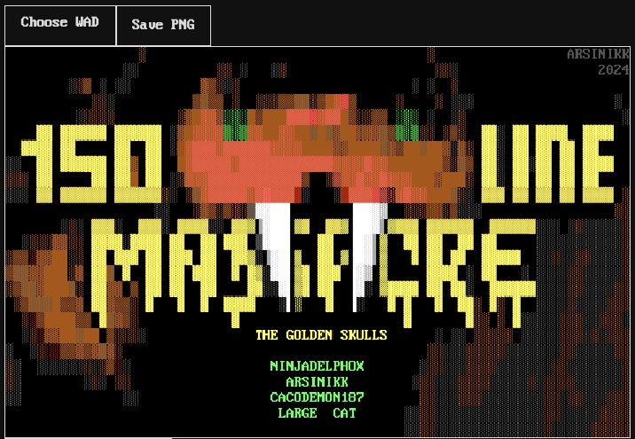

# endoom-viewer

Hosted at [endoom.pedro-beirao.eu](https://endoom.pedro-beirao.eu)



## Running locally

While this is a simple html page that you could simply open in your browser, I recommend you run it in localhost:

```bash
python3 -m http.server 8000
```

Since the demo ENDOOM graphics (Arsinikk's) would not be able to load otherwise (CORS issue).

## Credits

Font from https://int10h.org/oldschool-pc-fonts/
